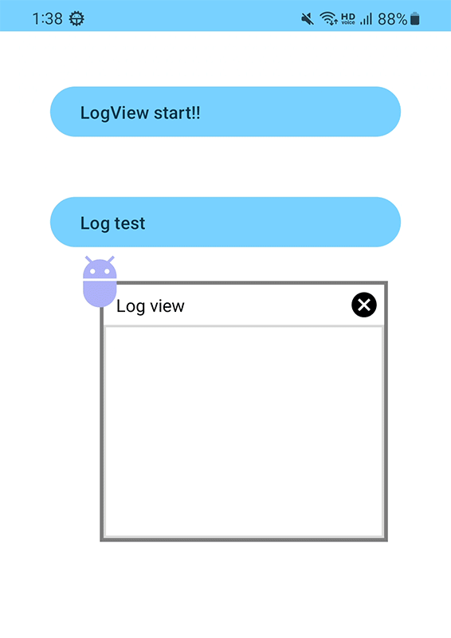

## Summary

Floating Android Log view

Use gradle - compose 1.4.0, compose compiler 1.4.4, kotlin 1.8.10

## Use Code

```kotlin
if (Settings.canDrawOverlays(this@MainActivity).not()) {
    // Add executable code after checking permissions
    startActivity(Intent(Settings.ACTION_MANAGE_OVERLAY_PERMISSION, Uri.parse("package:$packageName")))
} else {
    startService(ALogViewService.newInstance(this@MainActivity))
}
```

## Sample

